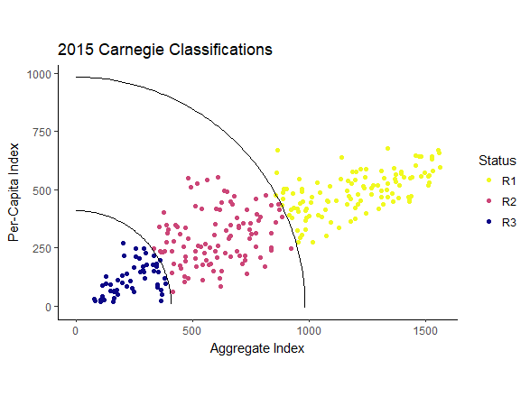

```{r, echo=FALSE}
htmltools::img(src = knitr::image_uri('msutrans.png'), 
               alt = 'logo', 
               style = 'position:absolute; top:1px; left:0px; padding:2px;height:100px;')

               
```

```{r setup, include=FALSE}
knitr::opts_chunk$set(echo = TRUE)
library(ggplot2);library(dplyr);library(plotly)
library(tibble); library(DT)
```

# Introduction
This document is designed to cover some of the high points of sparse clustering and its implementation in R using the sparcl. 

**A Note:** Sparcl package was removed from CRAN on 7/20/2018 "as check problems were not corrected despite reminders."(See page at https://cran.r-project.org/web/packages/sparcl/index.html.) However, there is another version out there by Kondo, Salibian-Bareera and Zamar (2016) called RSKC. 

# How does Sparse Clustering Work?


# Iplementations in R: 

```{r, fig.align = 'center', message = FALSE}
#installs and libraries the RSKC package
#install.packages('RSKC')
suppressMessages(library(RSKC))

#installs and libraries the Sparcl package (possibly deprecated)
#install the most recent version then use R-studio to install from archived file
#install.packages("C:/Users/r74t532/Downloads/sparcl_1.0.3.tar.gz", repos = NULL, type = "source")
#devtools::install_version('sparcl',version = '1.0.3')
#library(sparcl) #works on my laptop but not OPA computer
```


#Datasets 

## NBA Rookies 2017
```{r}
nba <- read.csv('data/na.csv', header = TRUE)

#pca-based
pc1 <- prcomp(nba[,-c(1,2,3)], scale = TRUE, center = TRUE)
summary(pc1)

#do some clustering
library(mclust)
modclust <- mclustBIC(pc1$x[,1:2])
mc <- Mclust(pc1$x[,1:2], x = modclust)

#build a dataframe
dat1 <- tibble(pc1$x[,1],pc1$x[,2],mc$classification); names(dat1) <- c('s1','s2','class')

#build a plot
p <- ggplot(dat1) + geom_point(aes(s1,s2,color = factor(class))) + ggtitle("NBA Rookies 2017") + theme_classic()

ggplotly(p)


##################
##Compare the Sparse Clustering Methods to this: 
library(RSKC)
spk <- RSKC(nba[,-c(1,2,3)], ncl = 3, alpha = 0, L1 = 1) # Sparse K-Means
#see documentation but alpha = 0 and l1 = 1 gives sparse K means
#to get "robust" sparse k-means, we need alpha >0 and L1 = 1

rspk <- RSKC(nba[,-c(1,2,3)], ncl = 3, alpha = .5, L1 = 1) # Robust Sparse K-Means

dat1$spk <- spk$labels
dat1$rspk <- rspk$labels

#gives the sparse k-means 
p2 <- ggplot(dat1) + geom_point(aes(s1,s2,color = factor(spk))) + ggtitle("NBA Rookies 2017") + theme_classic()
ggplotly(p2)


#gives the robust sparse k-means
p3 <- ggplot(dat1) + geom_point(aes(s1,s2,color = factor(rspk))) + ggtitle("NBA Rookies 2017") + theme_classic()
ggplotly(p3)

```

Additionally, the 'sparcl' package can be used to perform sparse clustering (although it might not be available as it is currently not on CRAN and must be installed from an archive). Insofar as I know, it is the only implementation for sparse hierarchical clustering. 

```{r, eval = FALSE}
#sparcl package as well
library(sparcl)
KMeansSparseCluster(nba[,-c(1,2,3)], K = 3, wbounds = 2)
#higher penalty on weights
KMeansSparseCluster(nba[,-c(1,2,3)], K = 3, wbounds = 2400)
```


###Assessment of Wine Data

```{r}
wine <- read.csv('https://archive.ics.uci.edu/ml/machine-learning-databases/wine/wine.data', header = FALSE)
names(wine) <- c("Class","Alcohol",'Malic Acid','Ash','Alcalinity of ash','Magnesium','Total phenols',
                 'Flavanoids', 'Nonflavanoid phenols', 'Proanthocyanins','Color Intensity',
                 'Hue','0d280/od315 of diluted wines','Proline')
head(wine)

#typical kmeans
km.wine <- kmeans(wine, centers = 3)
#sparse kmeans
sparse.wine <- RSKC(wine, ncl = 3, alpha = 0, L1 = 1)
#robust kmeans
robust.wine <- RSKC(wine, ncl = 3, alpha = 0.5, L1 = 1)

##look a bit at the 


##compare cluster membership
clusters <- tibble(wine$Class,km.wine$cluster,sparse.wine$labels, robust.wine$labels)
datatable(clusters, options = list(pageLength = 5, scrollX = 75))


```


#Looking at the Carnegie Classifications
The Carnegie Classifications are calculated using 2 PCAs that form an aggregate and per-capita index. Then, clustering could be performed on the resulting scores (in the actual version, schools are subjectively grouped by their location relative to two arcs that split the plot into three groups). 

Using the seven variables in the Carnegie Classifications, we can obtain a similar clustering solution without the initial dimension reduction step: 

```{r pressure, echo=FALSE, fig.cap="The 2015 update of the Carnegie Classifications, based on two PCAs", out.width = '100%'}

```

Here's the same plot with a different cluster of points. 

```{r}
##########
cc2015 <- dplyr::filter(read.csv("data/CC2015data.csv", header = TRUE, as.is = TRUE), BASIC2015 %in% c(15,16,17))
cc2015Ps<-
  na.omit(cc2015[,c("NAME","BASIC2010","BASIC2015","FACNUM","HUM_RSD","OTHER_RSD","SOCSC_RSD","STEM_RSD","PDNFRSTAFF","S.ER.D","NONS.ER.D")])

#calculate the ranked data
cc2015.r <- data.frame(cc2015Ps[,1:3],sapply(cc2015Ps[,-c(1:3)],minrank)) 


#apply sparse clustering
clust <- RSKC(cc2015.r[,-c(1:3)], ncl = 3, alpha = 0)
clust$labels

#table of clusters
table(clust$labels, cc2015.r$BASIC2015)
clust$labels[which(cc2015.r$NAME=="Montana State University")]    

#compare to a plot of the PCA-based version


```


#Some Key Questions:

With PCA-based clustering, the visualization is pretty intuitive. You can show the clusters with a plot of the first two principal components (I suppose this would look pretty good even if you clustered on more than the first two PCs). However, this does not achieve variable selection/sparsity. 
When using sparse clustering, what are the best ways to visualize? Should I look at the features that were selected and then use plots of them to demonstrate clusters? 


